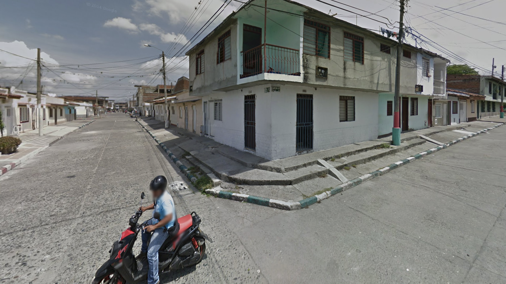
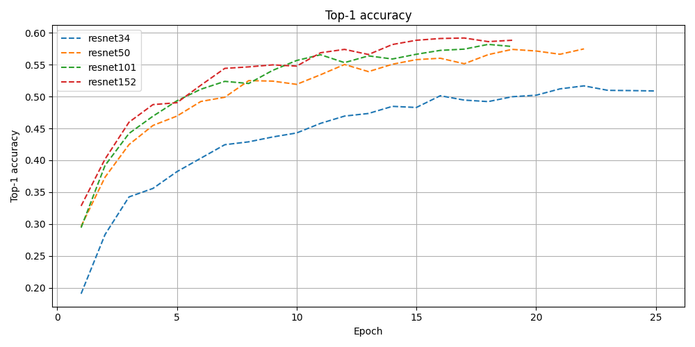
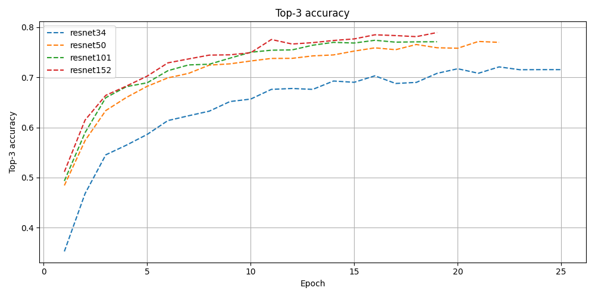
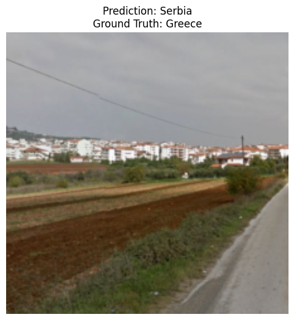
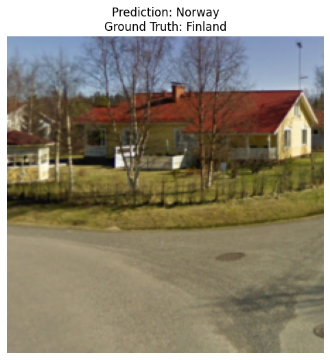
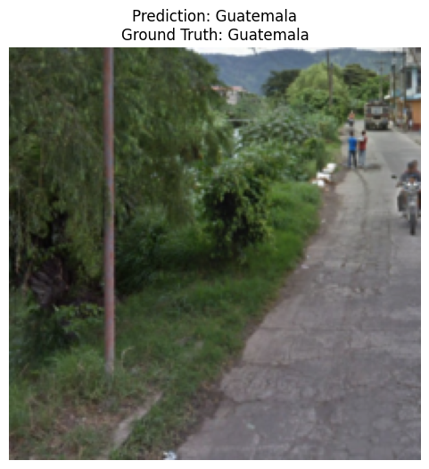
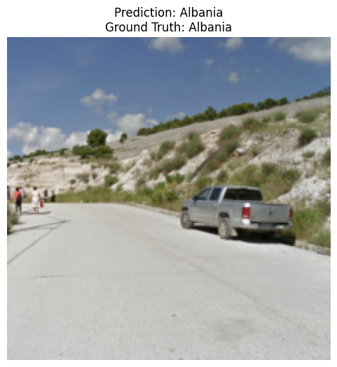
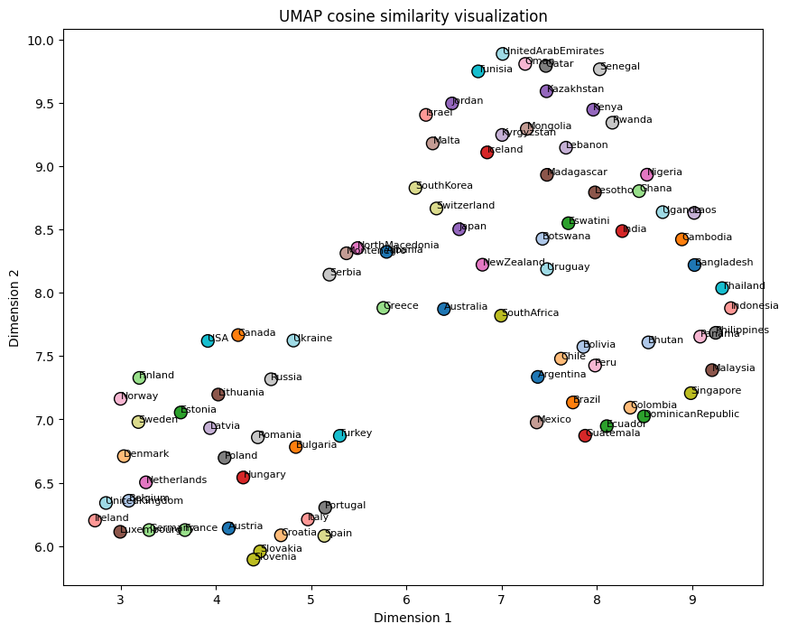
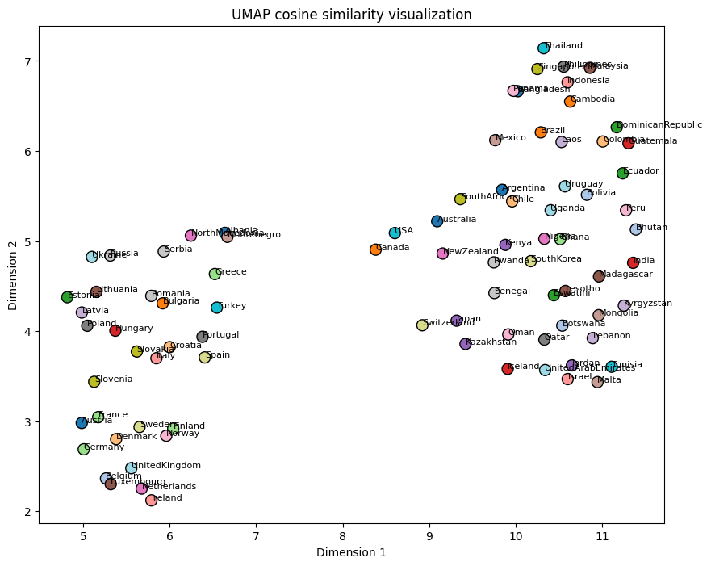

# GeoGuessrConvNet
Mirrored from my [blogpost](https://pepijnvanwijk.nl/blog/241215/geoClassifier.html) about this project:

In my first gap year after high school, I spent more time than I would like to admit on Google Maps. I would be mindlessly driving on Google Streetview, or I would just be scrolling through cities, seeing what kind of establishments they had in the different areas. I also got very much into [GeoGuessr](https://www.geoguessr.com/), a game where you get thrown somewhere in the world on Google Streetview, and your task is to guess the location. After playing it for a while, I grew out of it and started doing other stuff. Recently however, I got sucked in again. After playing for a week, I wondered how well a CNN classification network would do on some of the locations, so I started building.

The plan was to create a network capable of guessing which country an image is taken in. I decided to only include [official Geoguessr country maps](https://www.geoguessr.com/maps), totaling 85 different countries around the world.

The first, and probably the hardest part, was gathering a dataset. After searching online, I managed to find [some](https://www.kaggle.com/datasets/ubitquitin/geolocation-geoguessr-images-50k) datasets, however, they were either too small, imbalanced, or had the game UI visible on the screen. At first, I planned to make a dataset by hand, but after about 4 hours, I realized this would not be feasible. So, I started working on a [script](https://github.com/deboradum/GeoGuessrConvNet/blob/main/createDataset/createDataset.py) which would automatically start a round, take a screenshot, make a (random) guess, and go to the next round. After running this script for a couple of days, I managed to obtain 300 unique images per country, totaling about 25,000 1600x900 images, coming in at 60GB. You can download the dataset on [Huggingface](https://huggingface.co/datasets/deboradum/GeoGuessr-countries).

  
*An example of the dataset used for training. This is test image 24, in Colombia.*

After creating the dataset, I decided to use a ResNet backbone for the classifier, trying out ResNet-34, ResNet-50, ResNet-101, and ResNet-152 to see what the differences in performance would be. Since the dataset images are 1600x900, I randomly cropped a 448x448 patch from the image and resized it to 224x224 to feed it into the network. To find optimal learning rate, dropout rate, weight decay, and scheduler settings, I used [Optuna](https://optuna.org/) as an optimization library, early stopping a run when test loss did not decrease for three consecutive epochs.

  
  
*Top-1 and top-3 test accuracy of the various ResNets.*

The following results all come from the ResNet-101 model. All results can be downloaded [here](results.tar.gz) or are available on the [Github](https://github.com/deboradum/GeoGuessrConvNet/tree/main/results). Some interesting predictions include natural mistakes such as confusing Norway for Finland, or Serbia for Greece. However, it correctly predicts Guatemala from just some bushes and pavement, perhaps the pole that can be seen is unique to Guatemala, and the model learned to recognize that as a feature.

     
*Predictions and corresponding ground truth class labels, as predicted by the trained ResNet-101 model.*

### Classification Report

Unsurprisingly, relatively unique countries turned out to be easier for the network, as evidenced by the high scores of Iceland, Malta, Kyrgyzstan, and Lebanon. European countries scored notably worse due to higher StreetView coverage and similarity between neighboring countries.

| Country       | Precision | Recall | F1-Score | Support |
|---------------|-----------|--------|----------|---------|
| Albania       | 0.56      | 0.72   | 0.63     | 61.0    |
| Bangladesh    | 0.63      | 0.76   | 0.69     | 59.0    |
| Bhutan        | 0.83      | 0.80   | 0.81     | 60.0    |
| Brazil        | 0.43      | 0.33   | 0.37     | 60.0    |
| Iceland       | 0.85      | 0.87   | 0.86     | 60.0    |
| Lebanon       | 0.95      | 0.98   | 0.97     | 60.0    |

*(Some rows omitted for brevity; full report in [results.tar.gz](results.tar.gz))*

### UMAP Visualizations

Using t-SNE and UMAP embeddings, I visualized country similarities. European countries clustered on the lower left side, while tropical Asian and Latin American countries formed separate clusters.

  
*UMAP cosine similarity visualization (ResNet-101).*

  
*UMAP cosine similarity visualization (ResNet-152).*

All results, as well as training and evaluation code, are available on my [Github](https://github.com/deboradum/GeoGuessrConvNet). The dataset is also available on [Huggingface](https://huggingface.co/datasets/deboradum/GeoGuessr-countries).
